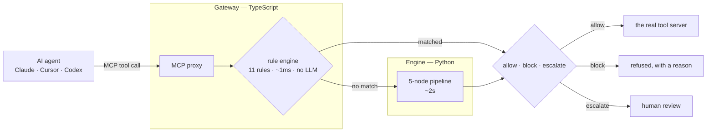
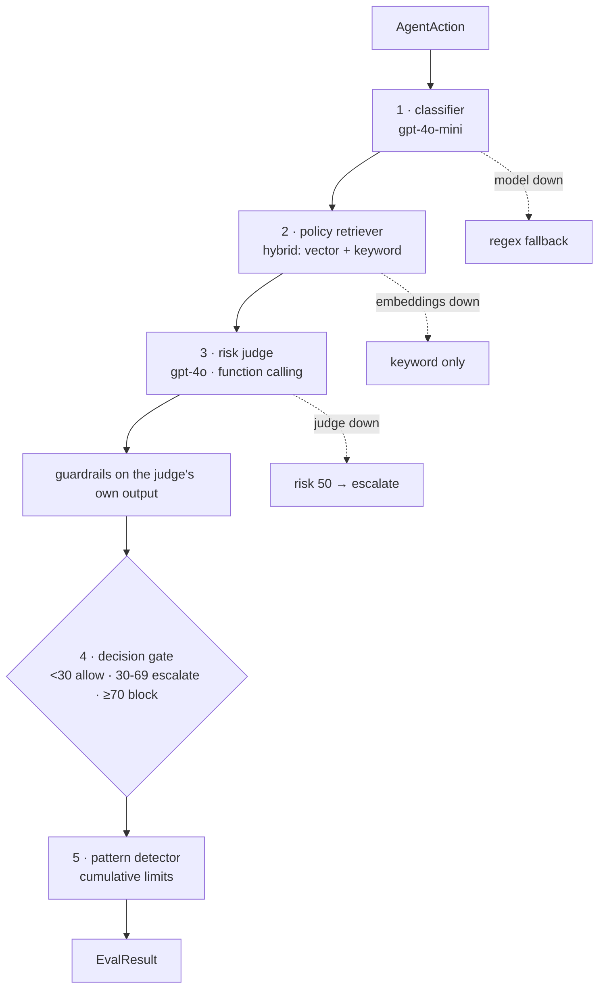
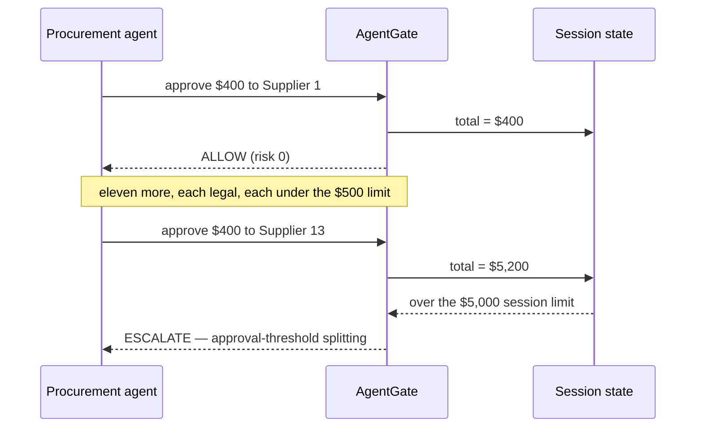

# AgentGate

**The firewall between your AI agents and the real world.**

AI agents can send emails, move money, run commands and query production
databases. Almost nothing sits between the agent and those tools to stop a bad
action *before* it happens. Guardrails validate text. Tracing tells you what
already went wrong. AgentGate refuses the action.

Every tool call an agent makes passes through AgentGate first and comes back
**allowed**, **blocked**, or **escalated to a human** — with a written reason
citing the company policy it violated.

```
agent: "email the customer their account details"
                    │
             AgentGate
                    │
   BLOCKED  risk 100/100  ·  2ms
   PII Protection — the email contains a Social Security number and a
   credit card number, which may never leave the organisation.
```

---

## How it works

Two tiers, two speeds. Cheap deterministic rules catch the obvious things in
under a millisecond. Everything ambiguous goes to a reasoning pipeline that
costs about two seconds and actually thinks.



The rule engine is the bouncer at the door. The engine is the manager you call
when the bouncer isn't sure.

### The engine pipeline



Each stage degrades rather than failing. The bias never changes: **a firewall
that cannot judge must not allow.**

### What no single-action check can catch



Thirty $400 purchases are thirty legal transactions and one fraud. The pattern
detector is the only thing in the system that can see it.

---

## Quick start

Two terminals. The engine must be up first — the gateway refuses to start
without it, because a firewall silently running rules-only is worse than one
that fails loudly.

```bash
cp .env.example .env          # OPENAI_API_KEY is the only required value
npm install

# terminal 1 — the engine
cd packages/engine && ./setup.sh && ./venv/bin/uvicorn server:app --port 8000

# terminal 2 — the gateway, in front of a real tool server
export AGENTGATE_ENGINE_URL=http://localhost:8000/evaluate
export AGENTGATE_ENGINE_KEY="$AGENTGATE_API_KEY"
npm run mcp -w packages/gateway -- customer-support
```

Then open **http://localhost:8000/dashboard** — a console for firing actions at
the engine and watching it decide, including a one-click run of the cumulative
scenario above.

### Connect a real AI agent

```bash
npm run mcp -w packages/gateway -- --config
```

Prints a ready `mcpServers` block. Merge it into
`~/Library/Application Support/Claude/claude_desktop_config.json`, quit Claude
Desktop with ⌘Q, reopen. Ask it to email a customer their SSN.

Works the same for Cursor, Codex and Windsurf — nothing here is
Claude-specific. Details in [packages/gateway/MCP.md](packages/gateway/MCP.md).

---

## Policies are the product

AgentGate ships with 21 default policies, but they are **configuration, not
code**. A policy is a markdown file:

```markdown
# PII Protection
Never include personally identifiable information in outbound communications:
a Social Security number, a payment card number, a bank account, a date of
birth, or a home address.
Severity: critical
Applies to: external_comms, data_access
```

The judge reads them; it cannot cite a policy that does not exist.

**Cumulative limits are declared the same way** — what gets counted is the
enterprise's choice, not ours. A bank counts dollars. A hospital counts patient
records. A SaaS company counts exported rows.

```markdown
Enforced by: pattern_detector
Accumulate: sum(toolArgs.amount)     # or count()
Applies to: financial
Limit: $5,000
When exceeded: escalate
Risk floor: 75
```

`POST /policies/reload` picks up a new file without dropping session state — an
operator edits a policy and the control is live.

---

## Guardrails on the judge itself

The evaluator gets evaluated. Four checks run on the judge's own output before
it can influence a decision:

| | |
| --- | --- |
| **Structured output** | score clamped to 0–100; a non-numeric score defaults to escalate, never to allow |
| **Policy grounding** | a cited policy is dropped unless it exists *and* was retrieved for this action |
| **Consistency** | the identical action twice in one session takes the stricter score |
| **Latency budget** | an evaluation over budget is flagged on the result |

---

## Measured, not claimed

```
rule engine      0.45 – 7ms      no LLM, no cost
engine           mean 1914ms · p50 1815ms · p95 2698ms
cumulative demo  fires at transaction #13, deterministically
tests            38 engine · 107/108 gateway · 100 eval scenarios
```

**The engine is slower than the original spec assumed (~500ms).** The fast path
is where low latency lives; the slow path buys judgement.

**Current benchmark: accuracy 69%, macro-F1 0.607.** Dangerous actions score
93.3% — it does not miss threats. The losses are over-refusal of things the
labels call escalations, and most of those trace to an unresolved disagreement
about spending thresholds rather than to the engine. That number is honest and
not yet good; see *What's left*.

---

## Layout

| package | owner | language | what |
| --- | --- | --- | --- |
| `gateway` | Person 1 | TypeScript | MCP proxy, 11 rules, Cloudflare Worker, D1, Sentry |
| `engine` | Person 2 | Python | LangGraph judge, RAG, policy-defined limits, console |
| `evals` | Person 3 | TypeScript | 100-scenario harness, regression gate, DeepEval cross-check |
| `demo-agents` | Person 3 | TypeScript | three real MCP tool servers, nine tools |
| `observability` | Person 3 | TypeScript | Sentry and LangFuse wiring |
| `shared`, `shared-types` | all | both | the contract |
| `apps/dashboard` | — | — | **not built yet** |

---

## Infrastructure

| | |
| --- | --- |
| **OpenAI** | gpt-4o judge, gpt-4o-mini classifier, text-embedding-3-small |
| **Cloudflare Vectorize** | policy vectors — live, with an in-memory fallback |
| **Cloudflare D1** | session state — live, with an in-memory fallback |
| **Cloudflare Workers** | the gateway |
| **LangFuse** | one trace per evaluation, a span per node, token cost per call |
| **Sentry** | errors and tracing on the gateway |

Both Cloudflare stores fail soft: unreachable means falling back to memory, and
`GET /health` reports which is actually in use so a silent fallback cannot be
mistaken for success.

---

## What's left

Honest, in priority order.

**The dashboard does not exist.** `apps/dashboard` is a single `package.json`.
The demo is built around two screens — the agent on the left, the action feed on
the right — and the right screen is empty. The engine's `/dashboard` console is
a developer tool, not that.

**No action log is persisted.** The gateway has a D1 `action_logs` schema and
the engine returns everything a feed would need, but nothing writes the rows.
Without them the dashboard has nothing to show.

**No Python SDK.** The spec's `from agentgate import wrap` one-liner is not
built. MCP and HTTP both work today.

**The eval threshold disagreement is unresolved.** The scenarios assume a
$10,000 limit; the engine and the demo use $500 and $5,000. Neither set of
numbers satisfies the current labels. Ten minutes of conversation is worth more
than any code here.

**Not deployed.** The engine runs on a laptop behind a Cloudflare tunnel. See
[packages/engine/DEPLOYMENT.md](packages/engine/DEPLOYMENT.md) — the engine is
Python and cannot run on Workers, so it needs a container host while the Worker
gateway calls it over HTTP.

Not started: the CSE log analyzer, the Zip integration, RAGAS.

---

## Docs

| | |
| --- | --- |
| [engine/ARCHITECTURE.md](packages/engine/ARCHITECTURE.md) | diagrams of every flow, and both integration paths |
| [engine/INTEGRATION.md](packages/engine/INTEGRATION.md) | how to call the engine |
| [engine/RUNBOOK.md](packages/engine/RUNBOOK.md) | seeing it work, and troubleshooting |
| [engine/DEPLOYMENT.md](packages/engine/DEPLOYMENT.md) | deployment plan and its one constraint |
| [gateway/MCP.md](packages/gateway/MCP.md) | connecting Claude Desktop, Cursor, Codex |

---

Built at Hack the North 2026.
