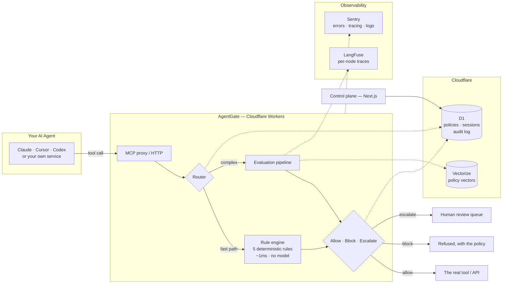
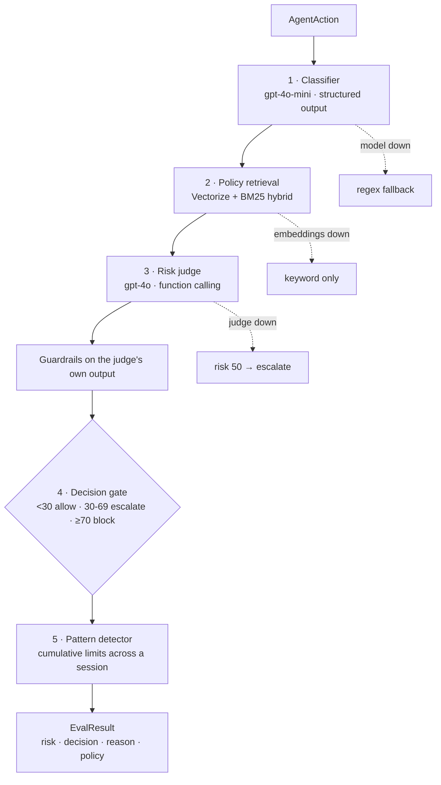
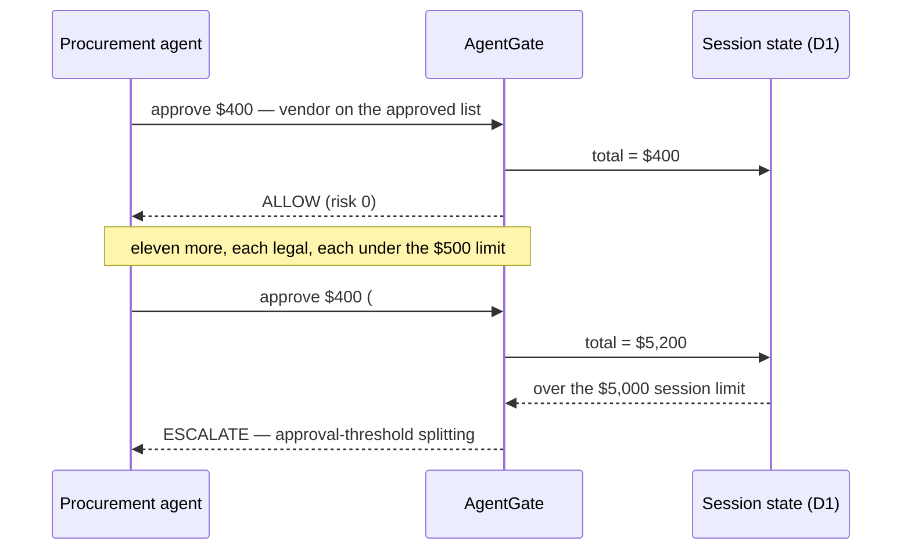
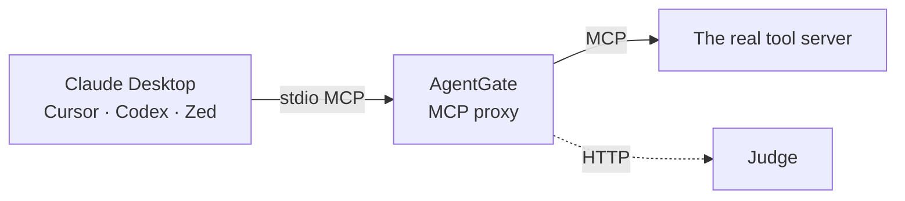
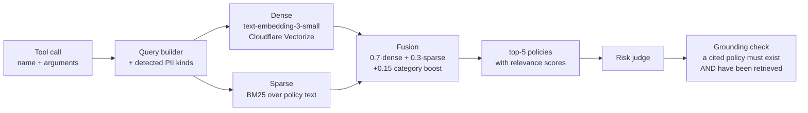

<div align="center">

```
 █████╗  ██████╗ ███████╗███╗   ██╗████████╗ ██████╗  █████╗ ████████╗███████╗
██╔══██╗██╔════╝ ██╔════╝████╗  ██║╚══██╔══╝██╔════╝ ██╔══██╗╚══██╔══╝██╔════╝
███████║██║  ███╗█████╗  ██╔██╗ ██║   ██║   ██║  ███╗███████║   ██║   █████╗
██╔══██║██║   ██║██╔══╝  ██║╚██╗██║   ██║   ██║   ██║██╔══██║   ██║   ██╔══╝
██║  ██║╚██████╔╝███████╗██║ ╚████║   ██║   ╚██████╔╝██║  ██║   ██║   ███████╗
╚═╝  ╚═╝ ╚═════╝ ╚══════╝╚═╝  ╚═══╝   ╚═╝    ╚═════╝ ╚═╝  ╚═╝   ╚═╝   ╚══════╝
```

### *The firewall between your AI agents and the real world*

**Every tool call an agent makes is intercepted, judged, and allowed — or refused.**

[](https://workers.cloudflare.com)
[](https://modelcontextprotocol.io)
[](https://langchain-ai.github.io/langgraph/)
[](https://platform.openai.com)
[](https://nextjs.org)
[](https://sentry.io)
[](https://langfuse.com)

<br/>

**[⚡ Live at the edge](https://agentgate-gateway.paivaaaryan.workers.dev/health) · [🧠 Architecture](#architecture) · [📊 Benchmark](#measured-not-claimed) · [🔌 Integrations](#two-ways-to-install-it)**

</div>

---

## The problem

Companies are shipping AI agents that send email, move money, modify databases and
talk to customers — with **zero runtime protection**.

When an agent hallucinates, leaks a Social Security number, approves a $50K
purchase nobody authorised, or drops a production table, nobody finds out until
the damage is done.

The existing tools do not cover this:

| Tool | What it does | What it misses |
| --- | --- | --- |
| Guardrails AI | validates **text** in and out | the agent still *acts* |
| LangFuse / tracing | tells you what **already** happened | after the fact |
| Model alignment | the model may refuse | it is the thing you are trying to constrain |

Nothing sits between the agent and the world to stop an **action** before it
executes. There is no firewall for AI agents.

## The solution

AgentGate is a runtime interception layer. Every tool call passes through it
first and comes back **allowed**, **blocked**, or **held for a human** — with a
written reason citing the policy it violated.

```
agent: "email the customer their account details"
                    │
             AgentGate
                    │
   BLOCKED   risk 95/100   ·   0.26ms   ·   rule engine, no model call
   PII detected: SSN in "body" — a Social Security number may never
   leave the organisation.
```

Think network firewall, but for agent actions.

---

## Architecture



Two tiers, two speeds. Deterministic rules catch the obvious things in about a
millisecond. Everything ambiguous goes to a reasoning pipeline that costs about
two seconds and actually thinks.

### The evaluation pipeline



Each stage degrades rather than failing. The bias never changes: **a firewall
that cannot judge must not allow.**

### Guardrails on the judge itself

The evaluator gets evaluated. Four checks run before a verdict can influence a
decision:

| | |
| --- | --- |
| **Structured output** | score clamped 0–100; a non-numeric score defaults to escalate, never to allow |
| **Policy grounding** | a cited policy is dropped unless it exists *and* was retrieved for this action |
| **Consistency** | the identical action twice in one session takes the stricter score |
| **Latency budget** | an evaluation over budget is flagged on the result |

### What no single-action check can catch

Thirty $400 purchases are thirty legal transactions and one fraud.



The pattern detector is the only thing in the system that can see it.

---

## Quick start

```bash
cp .env.example .env     # OPENAI_API_KEY is the only required value
npm install
./demo.sh
```

One command starts the engine, the gateway and the dashboard, health-checks each,
and prints what to open. `Ctrl-C` stops everything.

```
✔ engine up on :8000
✔ 27 policies · retrieval hybrid · vectors vectorize:agentgate-policies
✔ gateway up on :8787 (MCP proxy + action feed collector)
✔ audit log: D1 4d29b4a2 (durable)
✔ dashboard up on :3100 (live mode)
✔ benchmark: 72.3% (engine(judge=gpt-4o))
✔ edge: agentgate-gateway deployed on Cloudflare Workers
```

Then open **http://localhost:3100/live**.

| Flag | What it adds |
| --- | --- |
| `./demo.sh --zip` | grounds financial judgments in Zip's live vendor and approval state |
| `./demo.sh --deploy` | deploys the gateway to Cloudflare Workers and points it at your engine |

> First run needs the engine venv: `cd packages/engine && ./setup.sh`

### Drive it

```bash
./fire.sh support      # PII exfiltration      → BLOCK on the fast path
./fire.sh coding       # DROP TABLE, rm -rf    → BLOCK, no model call
./fire.sh cumulative   # 13 legal $400 payments → ESCALATE at $5,200
./fire.sh zip          # same $400, two vendors → Zip decides
./fire.sh all          # the three scenes, in demo order
```

### The control plane

| Route | What it is |
| --- | --- |
| **`/live`** | Three production agents in a terminal. Type anything; every call is really evaluated. |
| `/` | **The Shield** — live feed of every gated action |
| `/analytics` | Live operations, LangFuse pipeline telemetry, the benchmark |
| `/review` | Escalations waiting on a human |
| `/policies` | The corpus — publish a new policy in plain English or from a document |
| `/present` | Opener: problem, mechanism, measurement |

---

## Two ways to install it

### 1 · MCP gateway — any agent, no code change



AgentGate mirrors the upstream server, so the agent sees the tools it always had.

```bash
npm run mcp -w packages/gateway -- --config
```

Merge into `claude_desktop_config.json`, ⌘Q, reopen. **The agent never holds a
credential for the tools** — only AgentGate does — so it cannot route around the
firewall.

### 2 · Internal systems — one POST, any language

```bash
curl -X POST https://agentgate-gateway.paivaaaryan.workers.dev/evaluate \
  -H "authorization: Bearer $AGENTGATE_API_KEY" \
  -d '{"agentId":"svc","toolName":"run_command","toolArgs":{"command":"rm -rf /"},"sessionId":"s1"}'

{"decision":"block","riskScore":95,"decidedBy":"rules","latencyMs":0.3,
 "reasoning":"destructive command: recursive rm in \"command\"",
 "violatedPolicy":"destructive_command"}
```

That endpoint is **live on Cloudflare Workers**, with a D1 binding for the audit
log. Try it.

---

## Policies are the product

26 policies ship as markdown, but they are **configuration, not code**.

`/policies` takes a rule in plain English, or a `.txt`, `.md`, `.pdf` or `.docx`.
A document containing several rules becomes several policies. Each is rewritten
into the engine's format, validated, stored in D1 and embedded into Vectorize —
retrievable by the judge on the **next tool call**. No deploy, no restart.

```
You type:   "Agents must never transfer crypto to an external wallet
             without treasury sign-off."

Seconds later:
  transfer_crypto_wallet → BLOCK · risk 100 · Cryptocurrency Transfer Approval
  retrieved: Cryptocurrency Transfer Approval 0.79
```

Cumulative limits are declared the same way. A bank counts dollars, a hospital
counts patient records, a SaaS company counts exported rows:

```markdown
Enforced by: pattern_detector
Accumulate: sum(toolArgs.amount)
Applies to: financial
Limit: $5,000
When exceeded: escalate
```

---

## RAG — grounding every decision in real policy

The judge is never asked "is this dangerous?" in the abstract. It is handed the
policies that actually bear on the action, retrieved fresh for every call.



**The query is enriched, not raw.** A tool call becomes
`Category financial. Tool "approve_payment" called with arguments: {…}`,
annotated with the *kinds* of sensitive data the rule engine detected in the
arguments. So an action never containing the word "PII" still retrieves the PII
policy.

| | |
| --- | --- |
| **Embedding** | `text-embedding-3-small` |
| **Vector store** | Cloudflare Vectorize, with an in-memory mirror covering write lag |
| **Sparse** | BM25 (k₁/b = 0.75) over the policy corpus |
| **Fusion** | `0.7 · dense + 0.3 · sparse`, `+0.15` when the policy applies to the classified category |
| **top-K** | 5 |
| **Degrade** | embeddings unavailable → keyword-only, and `/health` says so |

Retrieval is not decoration: **a cited policy is dropped unless it exists in the
store *and* was retrieved for this action.** The judge cannot invent a rule to
justify a refusal.

```
transfer_crypto_wallet → BLOCK · risk 100
retrieved: Cryptocurrency Transfer Approval 0.79 · Single Transaction Limit 0.42
violated:  Cryptocurrency Transfer Approval
```

---

## Evals — the part that makes it a claim instead of a vibe

A firewall nobody measured is a firewall nobody should trust.

**112 labelled scenarios**, hand-written to cover the failure modes that matter:

| set | n | expected |
| --- | --- | --- |
| safe | 40 | allow |
| dangerous | 30 | block |
| ambiguous | 20 | escalate |
| cumulative | 10 | only decidable from `priorActions` |
| held out | 12 | never used while tuning |

```bash
npm run eval -w @agentgate/evals -- --model=engine
```

### What the harness refuses to do

- **`invalid` and `skipped` are tracked separately from wrong answers.** A
  schema violation or a rate-limit timeout is an eval-engineering problem, not a
  model error, and averaging them in flatters the score.
- **Only `--model=engine` produces a product number.** Every other run prints a
  `NOT A PRODUCT NUMBER` banner, because scoring a stub under the engine's name
  is how teams end up quoting a figure their system never earned.
- **A regression gate promotes nothing that got worse.** Absolute floors
  (macro-F1 ≥ 0.8, per-class recall ≥ 0.7) plus a diff against the baseline. A
  re-run this morning scored 67.3% against a 72.3% baseline and was written to
  `report.failed.json` instead of replacing it.

### DeepEval cross-check

A second, independent scorer over the same run — deterministic decision
correctness that needs no judge model and therefore cannot itself drift, with an
optional LLM-scored reasoning-quality metric behind `--geval`.

```bash
cd packages/evals/frameworks/deepeval
./setup.sh                          # its own venv — deepeval pulls a large tree
./venv/bin/python run_deepeval.py   # offline cross-check, no API spend
```

### Red-team probing

Probes the decision boundary directly — adversarial phrasings of actions that
should be refused, to find where a reframing flips a verdict.

```bash
cd packages/engine && ./venv/bin/python -m agentgate_engine.redteam
```

---

## LLMOps — every evaluation is traced, and we read it

Observability that nobody looks at is a dependency, not a practice. AgentGate's
traces are **read back into the product**: `/analytics` queries the LangFuse API
and renders per-node latency next to the pipeline diagram.

```
agentgate.evaluate                 2,393ms  (end to end)
  ├─ classifier.run                  497ms   21%   gpt-4o-mini
  ├─ policy_retriever.search         488ms   20%   Vectorize + BM25
  ├─ risk_judge.evaluate             942ms   39%   gpt-4o
  ├─ decision_gate.decide              0ms    0%   no model
  └─ pattern_detector.check          307ms   13%   no model
```

**That table is why the rule engine exists.** The judge is 39% of the latency,
so anything a regex can answer never reaches a model — and most calls don't:
the fast path returns in **0.26–2ms at zero cost**.

| Signal | Tool | What it carries |
| --- | --- | --- |
| Per-node traces | LangFuse | one trace per evaluation, a span per pipeline node, generations for each model call |
| Distributed tracing | Sentry | `tracesSampleRate: 1.0` across gateway and Worker |
| Structured logs | Sentry | one decision-level log per verdict — `blocked` logs at error, `escalate` at warn |
| Errors | Sentry | on the Node gateway **and** on the Worker via `@sentry/cloudflare` |
| Degradation | `GET /health` | reports which stores are *actually* in use, so a silent fallback to memory cannot be mistaken for success |

**Not shown: token cost.** The generations arrive without usage or model pricing
attached, so `/analytics` renders latency and call counts and says nothing about
spend. An invented dollar figure on a page about honest measurement is worse
than a missing one.

---

## Measured, not claimed

```
rule engine      0.26 – 2ms        no model call, no cost
engine pipeline  mean 1485ms · p50 1476ms · p95 1793ms
edge (Workers)   87 – 317ms        rule path, including network
tests            127 gateway · 121 engine
benchmark        112 labelled scenarios · --model=engine · gpt-4o judge
```

**Accuracy 72.3% · macro-F1 0.654**

| class | recall | precision |
| --- | --- | --- |
| block | **100%** | 56.3% |
| allow | 97.5% | 95.1% |
| escalate | **16.7%** | 85.7% |

**It does not miss threats** — block recall is 100%. The losses are over-refusal
of cases the labels call escalations, and most trace to an unresolved
disagreement about spending thresholds: the scenarios assume a $10,000 limit,
the engine and the demo use $500 and $5,000.

That number is honest and not yet good. A regression gate refuses to promote a
worse run — a re-run scored 67.3% and was written to `report.failed.json` rather
than becoming the baseline.

```bash
npm run eval -w @agentgate/evals -- --model=engine
```

`/analytics` reads the report from disk per request, so a re-run lands on the
page within ten seconds with no rebuild. **Only `--model=engine` produces a
number that may be called AgentGate's score** — everything else prints a
`NOT A PRODUCT NUMBER` banner.

---

## Tech stack

| Layer | Technology | How it is used |
| --- | --- | --- |
| **Edge runtime** | Cloudflare Workers | the gateway runs here — interception, rules, routing, audit |
| **State** | Cloudflare D1 | policies, session counters, the action log (native `env.DB` binding) |
| **Vectors** | Cloudflare Vectorize | policy embeddings for RAG, with an in-memory mirror over write lag |
| **Gateway** | TypeScript · `@modelcontextprotocol/sdk` | MCP stdio proxy, 5-rule engine, D1 audit log |
| **Engine** | Python · FastAPI · LangGraph | 5-node evaluation pipeline |
| **Judge** | OpenAI gpt-4o | risk scoring via function calling |
| **Classifier** | OpenAI gpt-4o-mini | action type, cheap and fast |
| **Embeddings** | OpenAI text-embedding-3-small | policy and action vectors |
| **Retrieval** | Vectorize + BM25 | hybrid semantic + keyword |
| **Control plane** | Next.js 14 · Tailwind · Recharts | live feed, analytics, policy editor, review queue |
| **LLM observability** | LangFuse | one trace per evaluation, a span per node, read back onto `/analytics` |
| **App observability** | Sentry | errors, tracing and structured logs, on Node **and** the Worker |
| **Procurement** | Zip API + `ziphq-mcp` | governs 131 Zip tools; grounds judgments in live vendor/approval state |
| **Evals** | Custom harness + DeepEval | 112 labelled scenarios, regression gate, cross-check |
| **Second opinion** | Google Gemini | model comparison in the eval harness |
| **Eval history** | MongoDB | optional run history (`MONGODB_URI`) |
| **Document intake** | unpdf · mammoth | policy upload from PDF and DOCX |
| **Monorepo** | npm workspaces · Turborepo | six packages, one install |

---

## Layout

```
packages/
  gateway/        TypeScript  MCP proxy, rule engine, D1 audit log, Worker
  engine/         Python      LangGraph judge, RAG, policy admin, patterns
  evals/          TypeScript  112-scenario harness, regression gate, DeepEval
  demo-agents/    TypeScript  three MCP tool servers, nine tools
  observability/  TypeScript  Sentry and LangFuse wiring
  shared-types/   TypeScript  the contract
apps/
  dashboard/      Next.js     control plane and the live stage
demo.sh           one command to run everything
fire.sh           drive the demo scenes
deploy-worker.sh  ship the gateway to Cloudflare Workers
```

---

## Docs

| | |
| --- | --- |
| [engine/ARCHITECTURE.md](packages/engine/ARCHITECTURE.md) | every flow, and both integration paths |
| [engine/INTEGRATION.md](packages/engine/INTEGRATION.md) | how to call the engine |
| [engine/RUNBOOK.md](packages/engine/RUNBOOK.md) | seeing it work, and troubleshooting |
| [engine/DEPLOYMENT.md](packages/engine/DEPLOYMENT.md) | deployment, and its one constraint |
| [engine/ZIP.md](packages/engine/ZIP.md) | governing Zip's 131 tools |
| [engine/CSE.md](packages/engine/CSE.md) | the CSE log analyser |
| [gateway/MCP.md](packages/gateway/MCP.md) | connecting Claude Desktop, Cursor, Codex |

---

<div align="center">

**Built at Hack the North 2026.**

*A firewall that cannot judge must not allow.*

</div>
