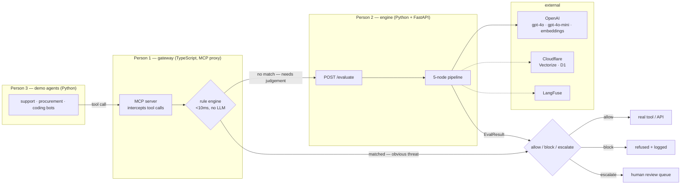
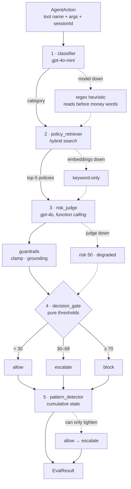
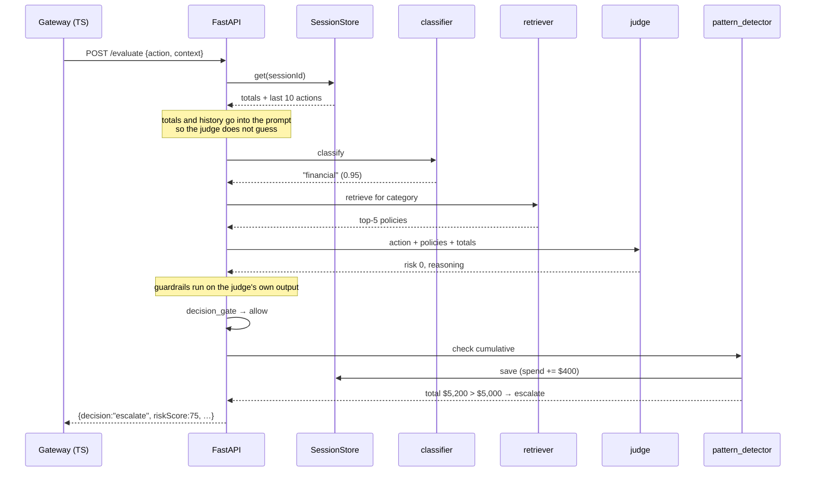
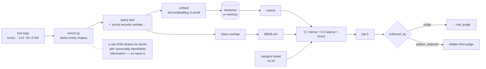
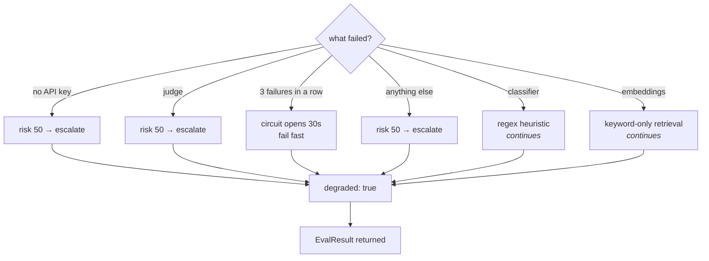
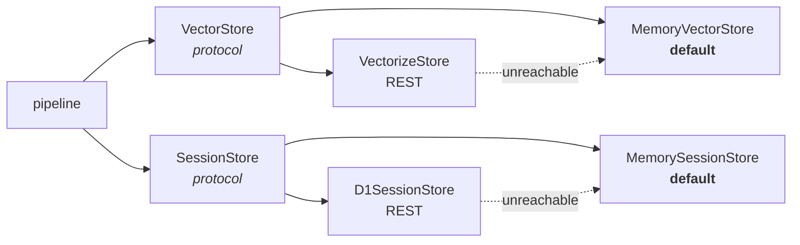
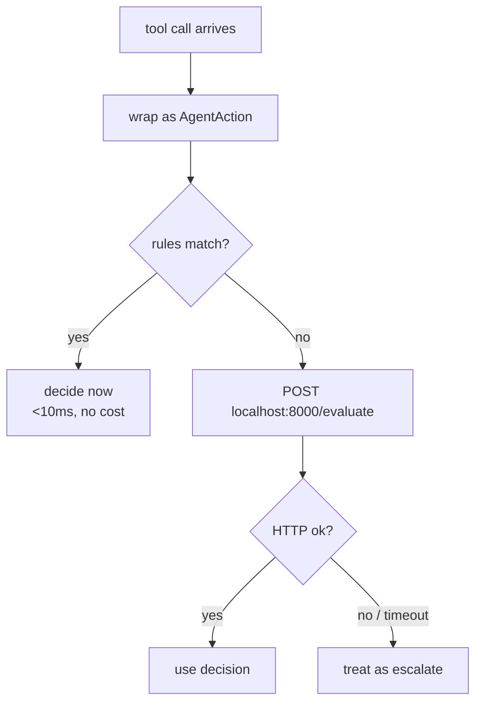
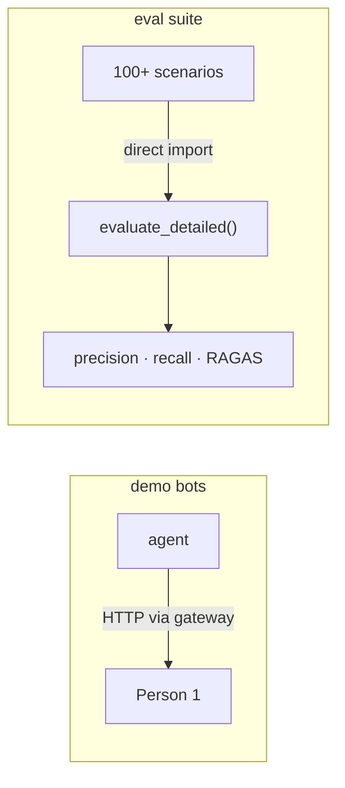
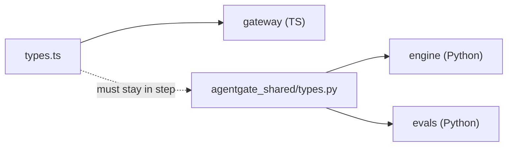

# AgentGate Engine — architecture and integration

How the engine works, and how Person 1 and Person 3 connect to it.

Everything below reflects the code as committed. Diagrams render on GitHub.

---

## 1. Where the engine sits



**Two layers, two speeds.** Person 1's rules kill `DROP TABLE` and raw SSNs in under 10ms with
no API cost. The engine handles everything ambiguous — and the cumulative patterns no
single-action check can see.

The engine **returns a judgement and enforces nothing.** Blocking, forwarding and the review
queue are the gateway's job.

---

## 2. The pipeline



| Node | Does | Model | Can it change the decision? |
| --- | --- | --- | --- |
| `classifier` | labels the action | gpt-4o-mini | no — routes retrieval |
| `policy_retriever` | finds the 5 relevant policies | embeddings | no — supplies evidence |
| `risk_judge` | scores 0–100 + reasoning | gpt-4o | yes — sets the score |
| `decision_gate` | score → decision | none | yes — pure thresholds |
| `pattern_detector` | cumulative checks | none | **only stricter, never looser** |

---

## 3. One request, end to end



The last two steps are the demo moment: the judge says **allow** on the individual $400 order
and is right to; the detector overrides to **escalate** because the session total just crossed
the limit.

---

## 4. Retrieval (the RAG path)



**Why cumulative policies are hidden from the judge.** Shown the *Cumulative Spending Limit*
policy, the judge sees a total "approaching" a threshold it can only guess at and escalates
early — measured firing at transaction 3, 7, 9 and 12 across runs. The detector holds exact
counts and fires at 13 every time. The policies are still retrieved and reported; they are just
not the judge's to apply.

Enrichment moved *PII Protection* from rank 2 to **rank 1** for an SSN-bearing email that never
says "PII" — and kept it at rank 1 in a live run where embeddings failed entirely.

---

## 5. Failure behaviour



**`evaluate()` never raises.** Every path returns a result. The bias is always the same: *a
firewall that cannot judge must not allow.*

`degraded: true` on the response means a node fell back — worth a badge in the dashboard.

---

## 6. Storage seams



The pipeline only ever sees the protocols, so switching to Cloudflare is one call:

```python
from agentgate_engine import configure_cloudflare_stores
await configure_cloudflare_stores()      # no-op without credentials
```

Both Cloudflare stores **fail soft** — unreachable means fall back to memory, not go down.
`GET /health` reports what is actually in use, so a silent fallback cannot be mistaken for
success:

```json
"storage": { "vectors": "vectorize:agentgate-policies", "sessions": "d1:a1b2c3d4…" }
```

---

## 7. Connecting — Person 1 (TypeScript gateway)



**Step 1 — start the engine.**

```bash
cd packages/engine && ./setup.sh
./venv/bin/uvicorn server:app --port 8000
curl -s localhost:8000/health        # expect "retrieval": "hybrid"
```

**Step 2 — call it, but only when your rules didn't decide.**

```ts
import type { AgentAction, EvalResult } from '@agentgate/shared';

const ENGINE = process.env.AGENTGATE_ENGINE_URL ?? 'http://localhost:8000';

export async function judge(
  action: AgentAction,
  sessionId: string,
  recentActions?: AgentAction[],
): Promise<EvalResult> {
  try {
    const res = await fetch(`${ENGINE}/evaluate`, {
      method: 'POST',
      headers: { 'Content-Type': 'application/json' },
      body: JSON.stringify({ action, context: { sessionId, recentActions } }),
      signal: AbortSignal.timeout(30_000),   // above the engine's 25s judge budget
    });
    if (!res.ok) throw new Error(`engine ${res.status}`);
    return await res.json();
  } catch (err) {
    // The engine is down. A firewall that cannot judge must not allow.
    return {
      riskScore: 50,
      decision: 'escalate',
      reasoning: `AgentGate engine unreachable (${err}); escalating for human review.`,
      latencyMs: 0,
    };
  }
}
```

**Step 3 — wire it after your rules.**

```ts
const ruled = runRules(action);
if (ruled.matched) return ruled;                  // fast path
return await judge(action, session.id, session.recent);
```

### Three things that will bite you

| | |
| --- | --- |
| **Stable `sessionId`** | All cumulative detection keys off it. A fresh id per action means the 30 × $400 demo silently never fires. Most common integration mistake — I made it myself while testing. |
| **Timeout above 25s** | That's the engine's internal judge budget. A shorter client timeout turns good decisions into needless escalations. |
| **Don't call it for everything** | Two LLM calls + an embedding per request. Let your rules do their job. |

### Response shape

```json
{
  "riskScore": 100,
  "decision": "block",
  "reasoning": "The attempted email contains a Social Security number…",
  "violatedPolicy": "PII Protection",
  "latencyMs": 1790,

  "category": "external_comms",
  "retrievedPolicies": [{ "name": "PII Protection", "score": 0.452 }],
  "patternNotes": [],
  "guardrails": [],
  "degraded": false
}
```

The first five fields are exactly the shared `EvalResult`. The rest are for the dashboard.
**An evaluation failure is never an HTTP error** — you get `escalate` with the reason inside.

---

## 8. Connecting — Person 3 (Python agents + evals)



**For demo bots — go through Person 1's gateway**, so you exercise the real path (rules first,
then the engine).

**For evals — import the engine directly.** No service to keep alive, and you get the structured
detail object.

```bash
pip install -e packages/shared -e packages/engine
```

```python
from agentgate_engine import evaluate_detailed, warmup, reset_sessions
from agentgate_shared import AgentAction

await warmup()                      # once — embeds the policy index

for case in scenarios:
    await reset_sessions()          # ← or cumulative state leaks between cases
    detail = await evaluate_detailed(AgentAction(
        agentId="eval", toolName=case["toolName"],
        toolArgs=case["toolArgs"], sessionId=case["id"],
    ))

    detail.result.decision          # vs case["expectedDecision"]
    detail.retrieved_policies       # → RAGAS context_relevancy
    detail.result.reasoning         # → RAGAS faithfulness
    detail.degraded                 # exclude degraded runs from metrics
```

### For cumulative scenarios, reuse one sessionId

```python
await reset_sessions()
for i in range(1, 31):
    d = await evaluate_detailed(AgentAction(
        agentId="proc", toolName="approve_payment",
        toolArgs={"vendor": f"Supplier {i}", "vendorStatus": "approved", "amount": 400},
        sessionId="cumulative-case",          # ← same id every iteration
    ))
```

`vendorStatus` matters: without it the judge is correctly unsure under *Vendor and Payee
Verification* and escalates at an arbitrary transaction. The scenario has to actually say what
it claims.

### Notes for your metrics

- **`tests/mock_openai.py`** is a scriptable fake client — deterministic CI at zero API cost.
  `tests/conftest.py` shows the wiring.
- **Exclude `degraded: true` runs** from precision/recall. Those are infrastructure failures,
  not judgement errors.
- **My `test_live.py` is a smoke test, not a benchmark** — 16 hand-written scenarios. Please
  don't quote its numbers on Devpost. Your dataset is the real measurement.

---

## 9. The shared contract



`packages/shared/` holds the same types twice, once per language. The wire format is
**camelCase** because that is what the TypeScript gateway sends; the pydantic models accept
camelCase and expose snake_case attributes.

**Change one, change the other, and tell the team.** This is the most fragile point in the
project.

---

## 10. Quick reference

| Endpoint | Use |
| --- | --- |
| `POST /evaluate` | the one Person 1 calls |
| `POST /judge/evaluate` | same handler, distinct name for logs |
| `GET /health` | liveness, config, storage backend, decision counts |
| `GET /policies` | all 21 — feeds the dashboard's policy editor |
| `GET /sessions/{id}` | live cumulative state: spend, action counts |
| `POST /sessions/reset` | clear state between demo runs |
| `GET /docs` | interactive API browser |

| Command | Does |
| --- | --- |
| `./setup.sh` | venv + deps, one time |
| `./venv/bin/pytest -q` | 35 tests, no API key needed |
| `./venv/bin/python demo.py` | narrated four-scene walkthrough |
| `./venv/bin/python demo.py --http` | same, driving the running service |
| `./venv/bin/python test_live.py` | 18 live scenarios against GPT-4o |
| `./venv/bin/python cloudflare_setup.py` | provision + verify Vectorize and D1 |
| `uvicorn server:app --port 8000` | the service |

See also: [README](README.md) · [INTEGRATION](INTEGRATION.md) · [RUNBOOK](RUNBOOK.md) ·
[DEPLOYMENT](DEPLOYMENT.md)
